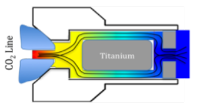
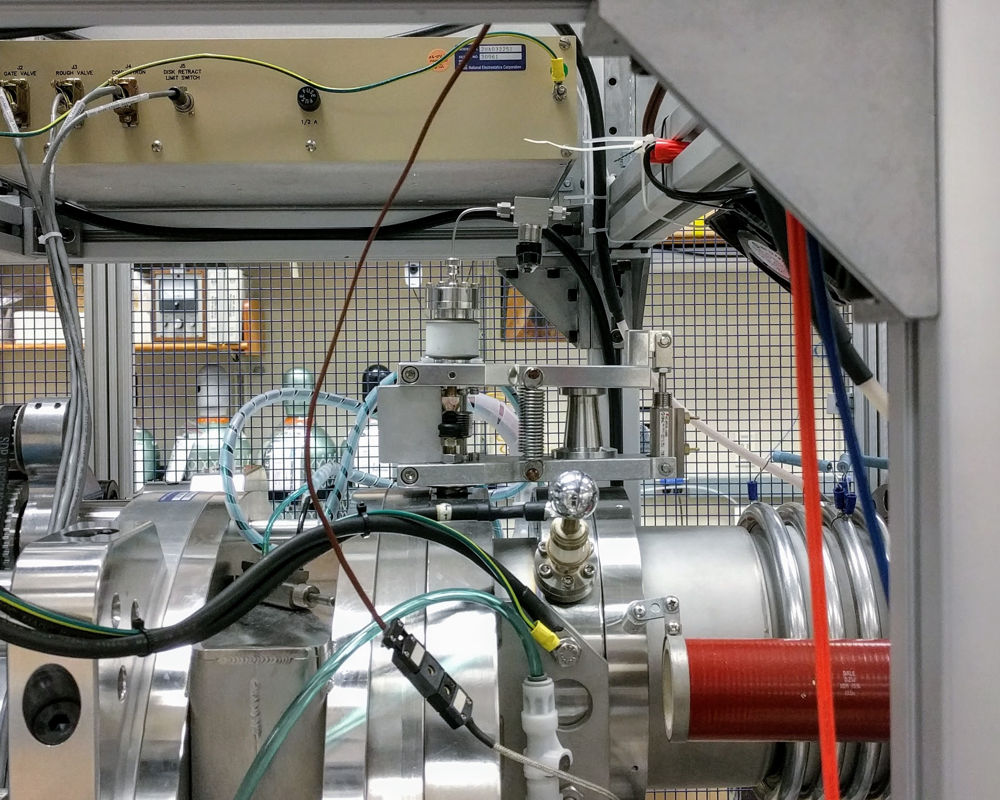
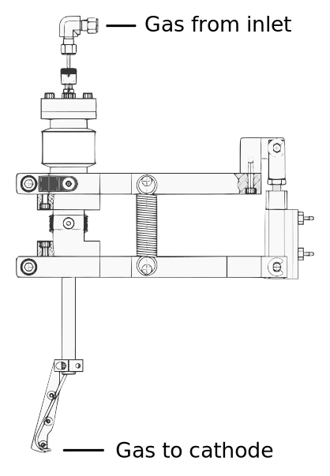
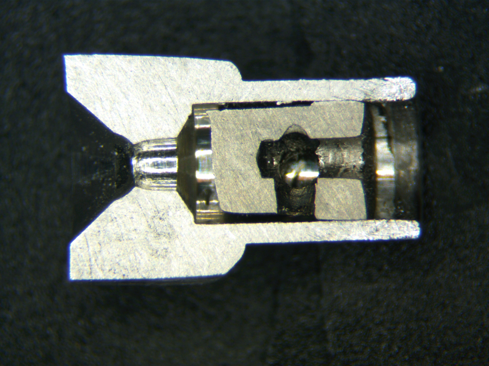
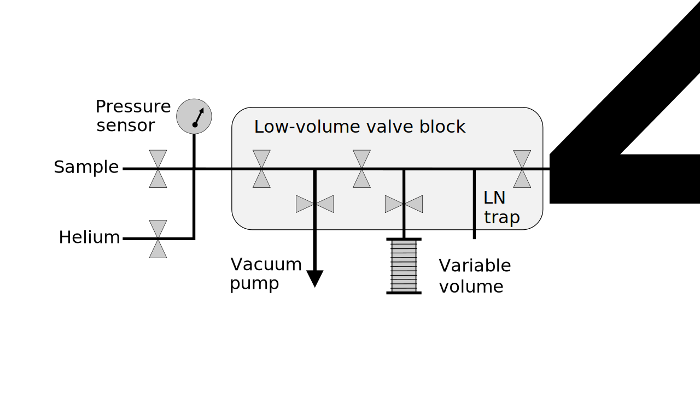
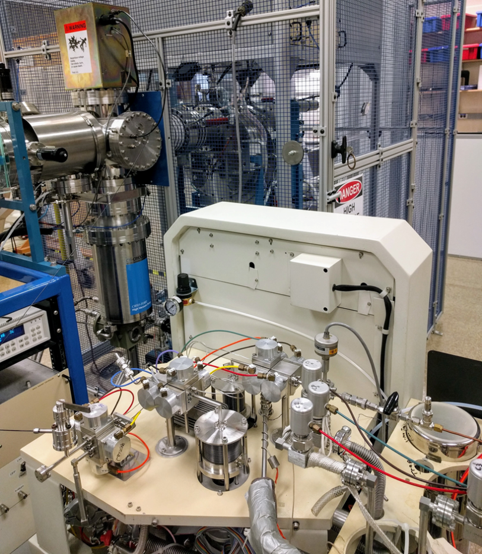
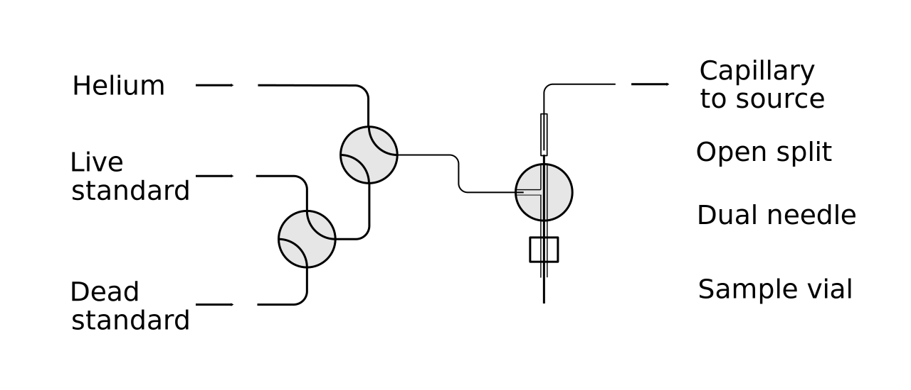
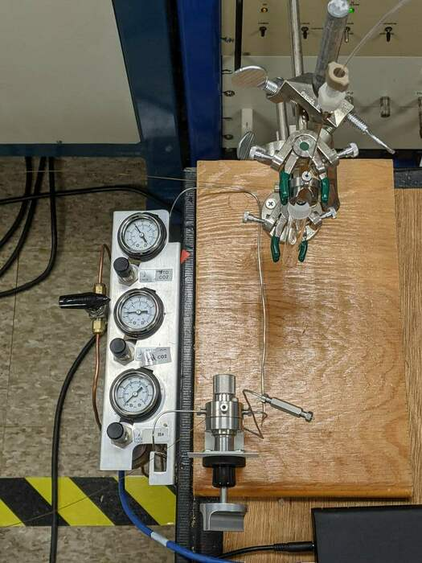

```{r setup, include=FALSE}
options(htmltools.dir.version = FALSE)
knitr::opts_chunk$set(echo = FALSE, message = FALSE, warning = FALSE)

# Libraries
library(tidyverse)
library(xaringanthemer)
library(here)
library(HybridGIS)
library(patchwork)
library(amstools)
library(gt)
library(knitr)

# Colors
dark_blue <- "#041e42"
light_blue <- "#00a9e0"
medium_blue <- "0069b1"
aqua_blue <- "#00b7bd"
cool_gray_11 <- "#53565a"
cool_gray_4 <- "#bbbcbc"
background <- "#e6e7e8"

style_mono_light(
  # colors
  base_color = dark_blue,
  # primary_color = background,
  # secondary_color = dark_blue,
  
  # fonts
  header_font_google = google_font("Montserrat", "800"),
  text_font_google = google_font("Red Hat Display", "500")
)
style_extra_css(
  css = list(
    ".title-slide" = list(
      "background-image" = "url(images/whoi_seal_title_bkgnd.jpg)",
      "background-size" = "cover"
    )
  ),
  append = TRUE,
  heading = "Extra CSS"
)
```

# Why run gas instead of graphite?


.pull-left[
### Benefits

- Skip a time-consuming reduction to graphite
- Eliminate blank associated with graphitization

### Challenges

- Ultimate precision is lower
- Lower currents/counts (time to precision)
- variability in blank (current dependent)
- variability in sample performance
]

.pull-right[
```{r}
methods <- tribble(~" ", ~"Graphite", ~"CFAMS ECR GIS", ~"Hybrid GIS",
                   "Continous flow", "No", "Yes", "No",
                   "Measurement time", "30 min", "5 min", "15-30 min",
                   "Precision", "0.3%", "1%", "1%",
                   "Background", "0.1 pmc", "1 pmc", "1 pmc")
methods %>% 
  kable(format = "html")

```
]

???

Performance = currents counts stability efficiency time

---

# How do you sputter a gas?


### $$CO_2+e^- \longrightarrow C^-+2O^-$$

.pull-left[
* Inject CO<sub>2</sub> gas onto Ti target
* Sputter with Cs<sup>+</sup>
* Dissociate molecules (hopefully)
* Produce C<sup>-</sup> ions (and O<sup>-</sup>, CH<sup>-</sup>, OH<sup>-</sup>, CO<sup>-</sup>...)
* Extract C<sup>-</sup> beam
]

.pull-right[

.right[Salazar, 2013]
]

???

introduction onto Ti surface in target recess

Predicted chemistry/physics of decomposition and ionization

---

# Method history

Middleton?
NEC: Xu 2006
ETH:
source and inlet refinement

State of the art:
- reproducibilty: 1%
- size: >= 10ug C
- speed: XX minutes per sample or samples/day

---

.pull-left[
# The NEC HGIS


* Modified to allow easy switch between solid and hybrid operation
* Rest is gas handling

```{r, echo=FALSE, fig.align='center', out.height='550px'}

# looks squished

```

]

.pull-right[

]

???

Figure/photo of NEC bellows system

---

# Targets

.pull-left[
Potential for:

* Lower cost
* Better performance
]

.pull-right[

NEC Hybrid target cutaway
]

---

# First tests

.pull-left[
### Conditions
* Modern and dead CO<sub>2</sub>
* 8m x 50 μm capillary
* 0-4 atm. supply pressure

### Results
* ~10μA <sup>12</sup>C<sup>-</sup>
* <1% precision
* 1% blank
* 1-3% total efficiency
]

.pull-right[
```{r, fig.height=6, dev='svg'}
read.csv(here("data/14Nov2017LPtest.csv"), skip = 4) %>%
  mutate(flow = flowcalc(supply/10, 2E-5, 1.49E-5, 1.58)) %>% 
  ggplot(aes(flow, current)) +
  geom_smooth(se = FALSE, span = 0.7, color = dark_blue) + 
  geom_point() +
  labs(title = "Current vs gas flow",
          x = "Flow (μl/min)", 
          y = "Source current (μA)") +
  theme_xaringan()
```
]

---

# Inlet systems

### $$PV=nRT$$

AKA interfaces

Closed vs Open

Introduce steady, reproducible current as key to data quality

Dilution

Makes moving small amounts of gas easier by increasing pressure

Source doesn't care about helium as long as it gets its CO2
pumping issues

Gas delivered at set rate

For a given sample size:
* High inlet volume = low inlet pressure (NEC inlet)
* Low inlet volume = high inlet pressure (Ionplus inlet)


Smallest samples require minimizing inlet volume and pressure while maintaining good flow control

---

.pull-left[
# Inlet systems - closed inlet

IRMS dual bellows

* VG Prism dual bellows
* LabVIEW interface
* 2 x bellows
* Cryotraps
* Manifold capable


]

.pull-right[

]

---

# Closed inlet results

plot: Results from breakseals

---

# Open split development

development

photo: gas panel

---

.pull-left[
# Open split

Use helium to displace CO2 from vials into split.

Capillary to source controls gas flow


]

.pull-right[
```{r, echo=FALSE, fig.align='center', out.height='550px'}

```
]
---

.pull-left[
# Carbonate method

Sample preparation

* Add acid to carbonate
* Fill vial with CO2 at 1 ATM

Measurement

Pre-sputter target
Displace sample 
Measurement

]

.pull-right[

figure: DAG graph of process
.center.middle[]
]

???

table: comparison of carbonate methods

---

.pull-left[
# Currents and flows

Balancing analysis time and flow rates to maximize stable currents and minimize sample size
]


.pull-right[
```{r, fig.height=8, dev='svg'}
data <- get_hgis_data(here("data/USAMS040121R.txt"), as.Date("2021-04-02")) %>% 
  filter(Pos == 5) %>% 
  mutate(time = cum_acqtime/60,
         co2flow = concCO2(time, r = 244) * 30) #30ul/min

# flow vs time subplot
flow_time <- data.frame(x = 0:125) %>% 
  ggplot(aes(x)) +
  stat_function(fun=function(x) concCO2(x, r = 244) * 30, aes(color = "CO2")) +
  stat_function(fun=function(x) 30 - (concCO2(x, r = 244) * 30), aes(color = "Helium")) +
  scale_color_manual("Gas", values = c("green", "blue")) +
  labs(title = "Gas flows to source",
       subtitle = "7mL vial, 244uL/min helium, 30ul/min to source",
       y = "Gas flow (uL/min)") +
  theme(axis.title.x = element_blank(),
        axis.text.x = element_blank(),
        legend.position = c(0.87, 0.65),
        legend.background = element_rect(fill = "white", color = "black")) +
  theme_xaringan()

# current vs time subplot
cur_time <- ggplot(data, aes(time, he12C)) +
  geom_smooth(span = .4, se=FALSE, color = "green") +
  geom_point() +
  xlim(0, 125) +
  labs(title = "Ion current",
       x = "Time (min)",
       y = "12C current (uA)") +
  theme_xaringan()

flow_time / cur_time
```
]

---

# Currents and flows

.pull-left[
* Note similarity to first tests
* Flat top means stable currents/ratios for long enough to measure
* Sample size can be reduced to 2mL
* Further reduction with increased flow to source
]

.pull-right[
```{r, fig.height=6, dev='svg'}
ggplot(data, aes(co2flow, he12C)) +
  geom_smooth(span = .3, se=FALSE) +
  geom_point() +
  labs(title = "Vial dillution current",
       subtitle = "250uL/min displacement, 30ul/min delivery",
       x = "CO2 flow (ul/m)",
       y = "12C current (uA)") +
  theme_xaringan()
```
]

???

compare to first tests

Note that our flat-topped current curve allows variable flow of the vial system. MICADAS has a more pronounced peak so this may not work as well. (Check papers for peak shape)

Also note current dependent ratio (blank) as a complicating factor

Lead into blank on next slide

---

# Results - blanks

## Current dependent blank

* Plot: ratio vs current for blanks and livegas
* plot: current dependent blanks with intersect

## Current independent correction

Current/target dependent?
Constant blanks and currents allow single mass independent correction

* plot: normalized Fm of blanks (dead gas, carbonates) over time 
* plot: blanks by day, average daily current and target blank current

???

Idea: use data from dillution runs of live and dead gas to create curves

It's relatively easy to produce runs with terrible current, but usually not good for blank as caused by other issues.

---

# Results - standards

precision
reproducibility

plot: gas standards. normalize all to OX-I (or mean of gas standards?) and plot vs time or by type with errors

reproducibility of straight gas vs vial standards


---

.left-column[
# Secondary standards

* Currents > 2uA
* Note current dependence

Data summary
mean difference
sd of diff

]

.right-column[
.right[
```{r, fig.height=6, fig.width=7.5, dev='svg'}
df <- map_dfr(list.files(here("data_analysed"), full.names = TRUE), read_csv) %>% 
  filter(!is.na(rec_num),
         Cur > 2) %>% 
  mutate(fm_diff = mean - fm_consensus,
         fm_sigma = sigma(mean, fm_consensus, merr),
         fmbc_diff = fm_lbc - fm_consensus,
         fmbc_sigma = sigma(fm_lbc, fm_consensus, merr))

ps <- 0.3
dw <- 0.03
yl <- .1

secs <- ggplot(df, aes(fm_consensus, fm_diff, color = Cur)) +
  geom_hline(yintercept = 0) +
  geom_smooth(method = "lm", se = FALSE) +
  geom_pointrange(aes(ymin = fm_diff - merr, ymax = fm_diff + merr), 
                  position = position_dodge2(width = dw),
                  size = ps,) +
  lims(x = c(-0.05, 1.1),
       y = c(-yl, yl)) +
  labs(title = "Difference from consensus",
       subtitle = "Uncorrected",
       y = "Fm difference") +
  theme(axis.title.x = element_blank(),
        axis.text.x = element_blank(),
        legend.direction = "horizontal",
        legend.position = c(.88, 1),
        legend.justification = "bottom")

secs_lbc <- ggplot(df, aes(fm_consensus, fmbc_diff, color = Cur)) +
  geom_hline(yintercept = 0) +
  geom_smooth(method = "lm", se = FALSE) +
  geom_pointrange(aes(ymin = fmbc_diff - merr, ymax = fmbc_diff + merr), 
                  position = position_dodge2(width = dw),
                  size = ps) +
  lims(x = c(-0.05, 1.1),
       y = c(-yl, yl)) +
  labs(subtitle = "LBC-corrected",
       x = "Fm consensus",
       y = "Fm difference") +
  theme(legend.position = "None")

secs / secs_lbc
```
]
]

???

precision, accuracy
issues with blank and normalization

---

# Sample size reduction

high dillution, high flow
pressure control to maintain constant CO2 to source

plot: dillution modelling plot
figure: setup with pressure control

---

# MICADAS

source differences
* one target in source at a time
* gas supplied via conical joint in side of target


photo: micadas source

---

# MICADAS - Carbonate method

inlet/method differences
* micadas uses closed system
* co2 from carbonates transferred onto resin trap in stream of he
* sample introduced by adding helium and adjusting flow using variable volume

More pronounced current vs. flow curve makes measurement more difficult at variable CO2 flow.
Salazar and Szidat are developing an open split interface with EA - squish peak with dead volume

---

# Summary

---

# NEC/Ionplus inlets

compare high and low volume approach
